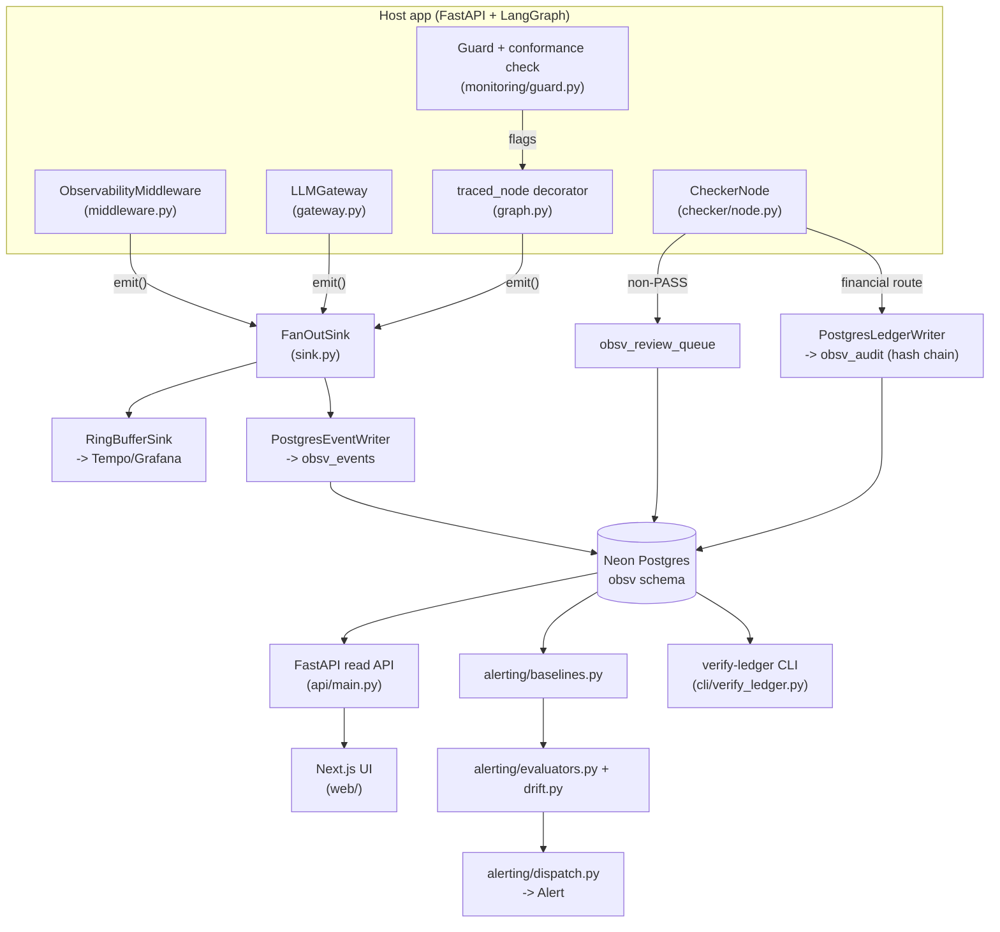

# obsvagent — Overview

What this is, how it's built, what's actually live right now, and what's
still open. Written 2026-07-21, after all 8 build phases in `HANDOFF.md`
landed. If this doc and the code ever disagree, trust the code — update
this file when that happens.

---

## 1. What this is

`obsvagent` is a shared observability, RAG-hallucination-checking, and
compliance-audit layer meant to be imported by every app in the
`C:\Workspace\Projects` ecosystem (FastAPI · LangGraph · Neon · multi-LLM),
instead of each app reinventing telemetry. It answers five concrete
questions the original design brief asked for:

1. **Architectural integration** — how do you capture latency/tokens/cost/
   trace-ids from FastAPI + LangGraph without meaningfully slowing requests?
2. **RAG & hallucination detection** — how do you catch an LLM answer citing
   a source it doesn't actually support, before or after it ships?
3. **Stateful agent monitoring** — how do you tell a legitimate iterative
   LangGraph loop from a dead loop, and a routine workflow from one that
   just skipped a required approval step?
4. **Compliance & audit trail** — for financial-grade projects (stablecoin
   treasury, risk decisions), how do you produce a tamper-evident record of
   every LLM interaction that fed a decision?
5. **Proactive alerting** — what should page a human before a user notices
   something's wrong?

Sections 4–7 below map each answer to actual code.

---

## 2. Architecture

**The hot path stays cheap on purpose.** `emit()` on every sink is an O(1)
in-memory append; all network/DB/OTel I/O happens later in `drain()`,
called by a background task, never inline with the request. Measured
middleware overhead: **p99 ≈ 0.04ms** (`scripts/bench_middleware.py`), well
under the 1ms budget.

**Everything reads/writes through Neon Postgres** (schema `obsv`) as the
single source of truth. Tempo is a second, parallel destination for the
same span data (via `FanOutSink`), used for trace visualization; Neon is
what the Checker, ledger, alerting, and UI all actually query.

---

## 3. Package map

| Path | What it does |
|---|---|
| `obsvagent/ids.py` | ULID trace-ids; monotonic `new_audit_id()` for the ledger |
| `obsvagent/schema.py` | `Telemetry` TypedDict + `telemetry_reducer` — the LangGraph state-merge contract |
| `obsvagent/otel.py` | Every OTel/GenAI + `obsv.*` attribute key, as constants (never hand-typed) |
| `obsvagent/cost.py` | `CostCalculator` over `pricing.yaml`, with effective-dated rate lookup |
| `obsvagent/middleware.py` | ASGI middleware: binds `trace_id` via `contextvars`, honors W3C `traceparent`, emits one event per request |
| `obsvagent/sink.py` | `RingBufferSink` (→ Tempo), `FanOutSink` (composes multiple sinks), `run_drain_loop` |
| `obsvagent/gateway.py` | `LLMGateway` — provider-agnostic (Anthropic/Gemini/DeepSeek) usage/cost extraction; caller supplies the actual model call |
| `obsvagent/graph.py` | `traced_node` decorator — LangGraph node instrumentation, domain-state hashing for cycle detection |
| `obsvagent/checker/` | `tier1.py` (lexical grounding), `judge.py` (Tier-2 LLM judge, pinned to `claude-haiku-4-5`), `node.py` (inline/shadow wiring), `schema.py` (frozen verdict contract) |
| `obsvagent/monitoring/` | `workflows.py` (frozen enterprise transition specs), `guard.py` (step/cycle/cost/wall-clock limits + conformance check) |
| `obsvagent/alerting/` | `baselines.py`, `evaluators.py` (8 signal functions), `drift.py` (PSI/KL), `dispatch.py` (debounced `Dispatcher`), `model.py` (frozen signal catalog) |
| `obsvagent/ledger.py` | `AuditRecord`, JCS canonicalization, SHA-256 hash chain, `verify_chain` |
| `obsvagent/ledger_writer.py` | `PostgresLedgerWriter` — fail-closed, Postgres-advisory-lock-serialized appends |
| `obsvagent/db/` | Migrations, DAOs (`EventDAO`/`TraceDAO`/`PayloadDAO`/`AuditDAO`/`ReviewQueueDAO`), `PostgresEventWriter`, `PostgresAuditQueueWriter`, retention job |
| `obsvagent/api/main.py` | FastAPI read endpoints + the review-decision write endpoint |
| `obsvagent/cli/verify_ledger.py` | `verify-ledger` console command |
| `web/` | Next.js 15 UI: trace list, reasoning-path graph, Audit Review Queue |
| `docker/` | Shared Tempo + Prometheus + Grafana compose stack |
| `eval/` | Curated Checker eval set (6 cases, all four grounding categories) |
| `scripts/` | `apply_migrations.py`, `bench_middleware.py`, `run_retention.py` |

`interfaces.py` pins the Protocol every pluggable component implements
(`EventSink`, `LLMGateway`, `GroundingChecker`, `Judge`, `LedgerWriter`,
`AlertDispatcher`) — the seam between the frozen contracts and everything
built on top of them.

---

## 4. Data model (Neon, schema `obsv`)

| Table | Purpose | Mutable? |
|---|---|---|
| `obsv_events` | Every span (HTTP request, LLM call, graph-node transition). Day-partitioned. | Insert-only |
| `obsv_traces` | One row per trace_id, rolled up (cost, tokens, node_path, flags, verdict) | Upserted |
| `obsv_payloads` | Raw request/completion/context-chunk text, hash + TTL | Content nulled on tombstone; hash kept |
| `obsv_audit` | The compliance **ledger** — one row per financial-grade LLM interaction, SHA-256 hash-chained | **Insert-only, enforced at the DB grant level** (`obsv_app` has no UPDATE/DELETE/TRUNCATE) |
| `obsv_review_queue` | The Checker's human-review queue — non-PASS verdicts, reviewer decisions | Reviewer decision UPDATEs in place |

Two roles: `obsv_app` (the running services — SELECT/INSERT everywhere,
INSERT-only on the ledger) and `obsv_retention` (SELECT/DELETE on events,
SELECT/UPDATE on payloads for tombstoning, **zero access to `obsv_audit`**
— retention can never touch the ledger, by grant, not just by convention).

---

## 5. Use cases

**Catch a hallucinated claim before it ships (financial route).**
A RAG answer on `treasury_orchestrator` cites a source that actually says
the opposite. `CheckerNode` runs inline (blocking) on financial routes;
Tier-1 lexical scoring flags the claim as ambiguous, Tier-2 (`claude-haiku-4-5`)
classifies it `CONTRADICTED`, and the response is blocked before it reaches
the caller — regardless of the overall unsupported-ratio threshold.

**Catch it after the fact (everything else).**
Same pipeline, but on non-financial routes the answer ships immediately and
the FAIL verdict lands in `obsv_review_queue` for a human to triage in the
Next.js UI — confirm hallucination, mark false positive, or flag the source
for a fix. That decision is the feedback loop for tuning Tier-1's τ
thresholds over time.

**Prove what a treasury decision was based on, after the fact.**
Every financial-grade LLM interaction gets an `AuditRecord`: exact model
version, prompt template version, retrieved context hashes, completion
hash, and the decision — all folded into a SHA-256 hash chain. `verify-ledger
--project treasury_orchestrator` re-walks the chain; any historical edit
(even by a compromised superuser — proven against a real tampered row in
testing) is detected and reported with the specific broken record id.

**Catch a LangGraph agent stuck in a loop, or skipping a required approval.**
`monitoring/guard.py` tracks `(node, domain_state_hash)` visit counts —
the same node revisited with *identical* domain state past a threshold is a
dead loop (`LOOP_SUSPECTED`), not legitimate iteration (which changes state
each pass). Separately, `check_enterprise_logic` replays the actual
node-visit path against a frozen allowed-transition spec (e.g. `execute`
requires `risk_check` + `approval` first on the treasury workflow) —
skipping a step is `ENTERPRISE_LOGIC_DEVIATION`, caught mechanically, not by
hoping the system prompt held.

**Notice a model degrading before a user files a complaint.**
`alerting/evaluators.py` compares a rolling window against a per-(model,
route) `Baseline`: p95 latency > 1.5×, error rate > max(2×, 5% floor),
completion length collapsing, grounding pass-rate under SLA, cost spiking,
cache-hit ratio collapsing. `Dispatcher` debounces — N consecutive
breaching windows before firing, one alert per incident, re-arms on a clean
window — so a single blip doesn't page anyone.

**See the reasoning path, not just the final answer.**
`/observability/[traceId]` renders the node chain colored by relative
latency, red-outlined when the trace carries a deviation flag, next to the
raw span list — the "what did the agent actually do" view for debugging a
weird output.

---

## 6. What's live right now

- **GitHub:** `github.com/Apolloat2022/observability-agent`, branch
  protection **Option B** on `main` (PR required, `test`+`web` CI must
  pass, admins included — no bypass, see `docs/BRANCH_PROTECTION.md`).
- **CI:** `test` (pytest/ruff/mypy) and `web` (Next.js build) jobs, both
  green; a **nightly ledger integrity check** (`verify-ledger` against
  `treasury_orchestrator` and `riskguard_assessment`) runs at 09:00 UTC —
  confirmed working via a manual `workflow_dispatch` run (both currently
  report "no audit records found", which is correct: nothing has written
  to either ledger yet — see §7).
- **Neon Postgres:** schema `obsv` fully migrated (6 migrations), roles
  `obsv_app`/`obsv_retention` provisioned with the grant model verified
  live (not mocked) in `tests/integration/`.
- **130/130 tests passing** (105 offline + 25 live-Neon integration), ruff
  clean, mypy clean across 37 Python source files. Next.js: clean
  `tsc --noEmit`, clean `next build`.

---

## 7. What's NOT done yet (be honest about these before relying on it)

**No real app is wired up yet.** Every test and demo run so far has used
synthetic/scripted data (fake judges, fake LLM responses, manually
constructed telemetry). **None of `riskguard-ai`, `stablecoin-orchestrator-
alpha`, `RAG-LLM-Project-showcase`, or `deep-agent-ai` actually imports
`obsvagent` yet.** That's the next real milestone — see the roll-out order
in `HANDOFF.md` (RAG showcase first, then deep-agent, then the financial
pair).

**Tier-2 judge has never made a real Anthropic API call.** `AnthropicJudge`
in `checker/judge.py` is fully built and unit-tested, but every test uses a
scripted `call_fn` standing in for the real model. Real judge accuracy
(precision/recall on real production claims) is unverified — that requires
wiring a live `claude-haiku-4-5` client and re-running the eval methodology
in `eval/` against real traffic.

**The Tempo/Prometheus/Grafana stack has never actually been started.**
`docker/docker-compose.observability.yml` exists and the port pre-check was
done, but `docker compose up` has never been run in this environment, so
Phase 1's original acceptance criterion — "a sample request yields a full
span tree in Tempo/Grafana" — has **not** been visually verified. `RingBufferSink`
is unit-tested against an in-memory OTel exporter, which proves the span
construction is correct, but not that a real Tempo instance renders it.

**On-chain ledger anchor (decision 2 in HANDOFF) is not built.** The locked-
Neon-branch side (role separation, grant model) is live and tested. The
on-chain head-commit for `stablecoin-orchestrator-alpha` specifically —
periodically anchoring the chain-head hash on-chain — has no code at all
yet; it needs a wallet/chain target decision before it can be built.

**No real alert transport is wired.** `Dispatcher` takes a generic
`transport: Callable[[Alert], None]` and is fully tested with a fake one;
nobody has plugged in a real Slack webhook, PagerDuty call, or any other
live destination.

**Drift signals have no real data feeding them.** `eval_embedding_drift`
and `eval_routing_drift` are tested against hand-built distributions;
nothing in the pipeline yet computes a live query-embedding distribution or
model-routing mix from real traffic to feed them. `cache_hit_collapse` is
in the same state — the evaluator exists, nothing populates a real cache-
hit-ratio series yet.

**Retention has no scheduler.** `scripts/run_retention.py` (tombstoning
expired `obsv_payloads`) is a manual script — there's no cron/GitHub Action
calling it on an interval yet, unlike `verify-ledger` which does have one.

**Auth on both the API and the UI is an explicit placeholder.**
`api/main.py`: a single shared `X-API-Key` (disabled entirely if
`OBSV_API_KEY` is unset). `web/lib/api.ts`: if a key is configured, it ships
to the browser in `NEXT_PUBLIC_API_KEY` — fine for local dev, not
production-safe (needs a server-side proxy route so the real key never
reaches client JS). Tenant scoping is a required header, not verified
against any real identity provider. Both are flagged 🟡 in the code
comments for exactly this reason.

**No saved Grafana dashboards.** The datasource provisioning
(`docker/grafana/provisioning/`) wires Tempo + Prometheus as data sources
automatically, but no actual dashboard JSON (latency percentiles, cost
trends, node-graph views) has been built — that's manual work once the
stack is actually running against real traffic.

**The Next.js UI was verified at the HTTP/API layer, not by a literal
browser click-through.** The Chrome extension wasn't connected in this
environment; verification was clean `next build` + exercising the exact
cross-origin fetch/POST calls the client JS makes (confirmed correct CORS,
data, and decision-persistence) — not a rendered-DOM visual check.

---

## 8. Suggested next steps, in order

1. Pick one non-financial app (per the roll-out order: `RAG-LLM-Project-showcase`)
   and actually wire `obsvagent`'s middleware + gateway + graph decorator into it.
2. Start the Tempo/Prometheus/Grafana stack for real and confirm a live
   span tree end-to-end; build the first Grafana dashboard.
3. Wire a real Anthropic client through `AnthropicJudge` and re-run the
   `eval/` methodology against real (not scripted) judge responses.
4. Wire a real alert transport (Slack webhook is the natural first one)
   into `Dispatcher`.
5. Decide the on-chain anchor target for `stablecoin-orchestrator-alpha`
   and build it.
6. Replace the placeholder API-key auth with real auth before any of this
   touches the financial-grade repos.
7. Schedule the retention job (a GitHub Action mirroring
   `nightly-ledger-verify.yml` is the simplest path, calling
   `scripts/run_retention.py` against `OBSV_RETENTION_DATABASE_URL`).
